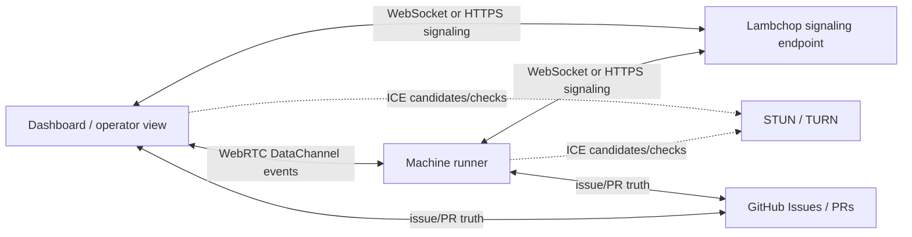

# Public STUN visibility transport research

## Decision summary

Do not describe the Lambchop visibility layer as "WebSocket negotiated via STUN."

STUN does not negotiate WebSocket connections. WebSocket is a client-to-server TCP/TLS connection. STUN is used by ICE to discover connectivity candidates for peer-to-peer transports, commonly WebRTC. The correct architecture is:

1. Use WebRTC DataChannel for peer-to-peer runner/dashboard event transport when direct connectivity is useful.
2. Use public STUN servers only for ICE candidate discovery during MVP/prototype work.
3. Use TURN as the required production fallback when direct peer connectivity fails.
4. Use WebSocket or HTTPS as the signaling channel and as a reliable fallback transport.

For Lambchop, the practical phrase is:

> The visibility layer uses a signaling channel to negotiate WebRTC DataChannel connections between dashboards and runner/project APIs. ICE uses configured STUN/TURN servers for NAT traversal. WebSocket remains the signaling/fallback path, not the STUN-negotiated transport.

## Why this matters

Lambchop is moving toward a standalone orchestration plane with multiple machine runners. A Windows runner, Mac runner, and dashboard may sit on different networks. The visibility layer needs low-friction connectivity without requiring every machine to expose an inbound public port.

WebRTC plus ICE addresses that. The dashboard and runner exchange connection metadata through a signaling channel, then ICE tests possible paths using STUN and TURN. If a direct path works, events can flow over a peer connection. If it does not, TURN relays traffic. If WebRTC setup fails entirely, WebSocket/HTTPS polling or server-sent events can remain the fallback.

## Protocol roles

### WebSocket / HTTPS signaling

Signaling is the control plane used to exchange:

- runner identity
- dashboard session identity
- WebRTC offers and answers
- ICE candidates
- auth/session tokens
- fallback instructions

This can be a normal public Lambchop rendezvous endpoint, a GitHub-backed control channel for slow paths, or a locally hosted hub reachable by both peers.

WebSocket does not use STUN for negotiation. It connects to a known server endpoint.

### WebRTC DataChannel

DataChannel is the candidate for live visibility streams:

- runner heartbeats
- run-container timeline events
- sandbox safety events
- validation status
- branch/PR/CI updates
- dashboard control acknowledgements

DataChannel gives Lambchop a browser-native peer transport that can use ICE, STUN, and TURN.

### STUN

STUN helps an endpoint discover the public IP/port mapping created by NAT and supports ICE connectivity checks. It is a discovery/checking tool, not a relay and not a WebSocket negotiation mechanism.

Public STUN is acceptable for prototypes and low-risk MVP paths, but it has constraints:

- availability is not under Lambchop control
- server policy/rate limits can change
- the runner's public network address is exposed to the STUN server
- STUN alone will not work through all NAT/firewall combinations

### TURN

TURN relays traffic when direct peer connectivity fails. Production-ready Lambchop should support a configured TURN server. Running a private TURN service, such as coturn, is the pragmatic long-term path for reliability and control.

TURN is more expensive than direct connectivity because traffic flows through the relay, but it is the correct fallback for locked-down networks.

## Recommended Lambchop architecture



### Connection sequence

1. Runner starts and registers with the Lambchop runner registry.
2. Dashboard opens a session and requests live visibility for one runner/project.
3. Signaling endpoint authenticates both sides.
4. Dashboard and runner exchange WebRTC offer/answer through signaling.
5. Both sides gather ICE candidates using configured STUN/TURN servers.
6. If a direct path works, DataChannel carries live visibility events.
7. If direct path fails, TURN relays the DataChannel.
8. If WebRTC fails, dashboard falls back to WebSocket/SSE/HTTPS status updates from the signaling endpoint or project API.

## Security model

The visibility transport must not weaken the sandbox model.

Required guardrails:

- Authenticate dashboard sessions and runner sessions before signaling.
- Authorize which dashboard session can observe or control which runner/project.
- Encrypt all signaling with TLS.
- Prefer WebRTC DTLS/SCTP DataChannel for encrypted peer transport.
- Do not expose worker sandbox credentials over DataChannel.
- Treat dashboard commands as requests queued to Lambchop, not direct shell execution.
- Rate-limit signaling and event streams.
- Log runner id, dashboard session id, transport selected, TURN usage, and fallback reason.

## MVP recommendation

For the first implementation:

1. Add a signaling abstraction, not a hard-coded transport.
2. Keep current WebSocket/SSE project API behavior as fallback.
3. Add WebRTC DataChannel support for live runner events.
4. Configure public STUN for development only.
5. Require configurable TURN before calling the feature production-ready.
6. Show transport status in the dashboard: `direct`, `turn-relayed`, `websocket-fallback`, or `offline`.

## Self-discovery without a dedicated Lambchop server

The target requirement is valid, but it needs precise language:

> Lambchop should not require the operator to host a dedicated visibility/signaling server.

The more accurate product shape is:

> Lambchop machines should form a trusted peer-to-peer runner network. Each machine is a peer with identity, capabilities, leases, local evidence, and live event streams. The dashboard is one peer view into that network, not the central authority.

It cannot mean:

> Two arbitrary machines behind NATs discover each other on the public internet with no shared rendezvous path.

For cross-network discovery, the peers need some shared coordination substrate. STUN can help peers discover NAT mappings and perform ICE checks, but it does not tell a dashboard which runners exist, exchange WebRTC offers/answers, authenticate sessions, or distribute ICE candidates. That is signaling/discovery work.

### Recommended serverless-first discovery model

Use layered discovery:

1. **GitHub-backed rendezvous** for cross-machine discovery.
   - Runners publish small signed/attributed presence records to the managed repo, a portfolio repo, issue comments, a GitHub branch, or another GitHub-hosted artifact.
   - Dashboards read those records to discover runners, capabilities, last-seen timestamps, and candidate signaling channels.
   - This avoids operating a Lambchop-specific public server while preserving shared context across Windows/Mac machines.

2. **Local network discovery** for same-LAN convenience.
   - Use mDNS/Bonjour or local broadcast where available.
   - This can make a dashboard find a nearby runner without GitHub polling.
   - It is an optimization only; it will not solve cross-internet discovery.

3. **Direct WebRTC DataChannel** when ICE succeeds.
   - GitHub or local discovery provides identity and signaling data.
   - ICE uses STUN/TURN to find a viable path.
   - DataChannel carries live events after connection.

4. **GitHub/HTTPS fallback** when live peer transport fails.
   - Runners continue updating issue comments, PRs, run summaries, and compact registry records.
   - Dashboard shows cached/live-enough state even without a peer connection.

## Peer-to-peer runner network model

The Lambchop network should treat each trusted machine as a peer, not as a passive worker attached to a central server.

### Peer responsibilities

Each peer should be able to:

- publish its signed runner identity and capabilities
- discover other trusted peers
- exchange live run-container events with peers
- claim leases for GitHub Issues and branches
- hand off or resume work after another peer stops
- expose local OFK-style work logs by reference
- verify that another peer's lease/run evidence maps back to GitHub Issue/PR truth

### Authority model

The peer network should not make local peers authoritative over work completion.

- GitHub Issues remain authoritative for work identity and issue status.
- GitHub PRs remain authoritative for integration and closure.
- Peer records are authoritative only for peer-owned runtime facts: machine identity, heartbeat, leases, capabilities, sandbox/run evidence, and local log pointers.
- A peer can claim "I am working issue #41 on branch X"; it cannot unilaterally make issue #41 done outside the GitHub issue/PR workflow.

### Peer discovery layers

Use multiple discovery layers rather than a mandatory server:

1. **LAN discovery:** mDNS/Bonjour for nearby peers.
2. **GitHub rendezvous:** signed peer presence records for cross-network discovery and recovery.
3. **Known peer cache:** each machine keeps recently trusted peer identities and last known connection metadata.
4. **Optional bootstrap peers:** later, a user may designate one always-on machine or hosted endpoint as a convenience bootstrap, but it must not become required for correctness.

### Peer connection layers

Preferred live path:

1. Discover peer identity through LAN or GitHub.
2. Exchange WebRTC offer/answer and ICE candidates through the available discovery/signaling layer.
3. Establish WebRTC DataChannel for live event exchange.
4. Fall back to GitHub-backed status when no live path is available.

### Conflict handling

The peer network must assume two machines can be online at once.

- Leases are scoped to GitHub Issue, branch, repo, runner id, and expiry.
- A peer must not start work when an unexpired conflicting lease exists.
- Stale leases can be challenged by checking peer heartbeat and GitHub branch/PR activity.
- Parallel work is allowed only when issue scope or lane scope is explicit.
- GitHub remains the reconciliation anchor when peer records disagree.

### Security requirements

Peer-to-peer does not mean unauthenticated peer-to-peer.

- Each peer needs a stable identity key.
- Peer records should be signed.
- A new peer should require explicit trust or membership approval.
- Live peer messages should be authenticated and encrypted.
- Dashboard/control messages should be intent requests, not direct command execution.
- A peer should expose only bounded run evidence and event streams, not arbitrary filesystem access.

## Observability with feedback

The peer network should not be a passive status stream. Lambchop needs observability that can feed decisions back into the orchestration loop.

### Observability data

Each peer should publish structured events for:

- peer heartbeat and capability changes
- issue selection and lease changes
- sandbox creation and teardown
- worker adapter start/stop
- command phase summaries
- changed-file summaries
- validation start/pass/fail
- blocked command or policy denial
- branch push and PR creation/update
- CI/review state changes
- issue comment updates
- human decision requests and responses
- run completion, abandonment, or handoff

These events should support three views:

1. **Timeline:** what happened in order.
2. **Current state:** what is true now.
3. **Feedback prompts:** what needs a human, peer, or worker to do next.

### Feedback types

Feedback should be explicit and typed:

- `approve`: allow a proposed action to continue
- `reject`: stop a proposed action and record why
- `revise`: ask the orchestrator to change scope or approach
- `pause`: pause a run, peer, repo, or issue
- `resume`: resume paused work
- `reassign`: move a run or issue to another peer
- `escalate`: mark a blocker as requiring human decision
- `retry`: rerun a failed validation or worker step
- `tighten-policy`: convert an observed problem into a stricter guardrail
- `loosen-policy`: grant a narrow exception with audit evidence

Feedback should become durable evidence. For GitHub-backed work, major feedback should be mirrored into issue or PR comments so another machine can recover context.

### Feedback transport

Live peer transport can carry feedback quickly, but it must not bypass the orchestrator.

- WebRTC DataChannel may carry low-latency feedback messages.
- GitHub issue/PR comments remain the durable fallback and audit trail.
- The orchestrator validates feedback against policy before acting.
- Shell execution, file mutation, PR mutation, and issue mutation remain orchestrator actions, not direct dashboard actions.

### Feedback loop into orchestration

The orchestrator should consume feedback as part of scheduling and guardrail decisions:

- repeated validation failure can trigger a repair run or human escalation
- repeated policy denial can create a guardrail-improvement issue
- human rejection can update issue scope or create an ADR/decision record
- peer failure or offline status can release/reassign a lease after the configured timeout
- review feedback can dispatch a repair worker against the same PR branch
- successful runs can update adapter capability confidence for future scheduling

### Minimum MVP contract

For MVP, observability with feedback should include:

- append-only run event stream
- current run state projection
- issue/PR comment mirroring for major state changes
- dashboard controls that queue typed feedback requests
- orchestrator validation of every feedback request before action
- visible feedback result: accepted, rejected, queued, applied, or blocked

### Registry record shape

A runner presence record should stay small and non-sensitive:

```json
{
  "runner_id": "bill-windows-workstation",
  "machine_label": "Windows workstation",
  "platform": "windows",
  "capabilities": ["codex-cli", "claude-cli", "docker", "webrtc-datachannel"],
  "managed_repos": ["justbill2020/Lambchop"],
  "active_runs": [
    {
      "issue": 41,
      "branch": "codex/lambchop-issue-41",
      "run_container_id": "run-20260623-visibility-001"
    }
  ],
  "transport": {
    "supports_webrtc": true,
    "supports_lan_mdns": true,
    "fallback": "github"
  },
  "last_seen_at": "2026-06-23T00:00:00Z"
}
```

Do not include local filesystem paths beyond coarse workspace labels, secret values, raw transcripts, private IPs unless explicitly needed for LAN discovery, or direct shell command channels.

### What this buys

- No always-on Lambchop cloud service is required for MVP.
- Windows and Mac runners can share context through GitHub.
- The dashboard can discover peer runners from GitHub or LAN and then attempt live WebRTC.
- Offline runners remain visible through last-seen metadata.
- The design can later add an optional hosted rendezvous service without changing the runner/dashboard contract.

### Constraint to keep explicit

If both peers are behind restrictive NAT/firewalls and no TURN relay is configured, live peer connectivity may fail. In that case, Lambchop should degrade to GitHub-backed status and issue/PR comments rather than pretending the runner is unreachable or broken.

## Fit with multi-machine runners

This design supports Windows and Mac runners without file synchronization:

- GitHub remains shared truth for Issues and PRs.
- The Lambchop runner registry records machine identity, platform, capabilities, and leases.
- Local OFK-style logs stay on the runner that produced them.
- Live visibility can connect dashboard to whichever runner is active.
- If a runner is offline, dashboard shows cached registry/GitHub state and marks live transport unavailable.

## Open decisions

- Where should the discovery/signaling records live for MVP: portfolio repo branch, GitHub issue comments, GitHub release artifact, or local registry file committed to a dedicated coordination repo?
- Should a hosted Lambchop rendezvous service remain optional rather than required?
- Should Lambchop run its own TURN server for trusted operators, or require users to provide TURN credentials?
- Which dashboard actions are safe over live DataChannel versus queued through the normal GitHub/orchestrator control path?
- How much event history should be mirrored from local runner logs into issue comments or PR comments for cross-machine recovery?

## Sources

- MDN WebRTC signaling guide: https://developer.mozilla.org/en-US/docs/Web/API/WebRTC_API/Signaling_and_video_calling
- MDN WebRTC protocol overview: https://developer.mozilla.org/en-US/docs/Web/API/WebRTC_API/Protocols
- WebRTC peer connection guide: https://webrtc.org/getting-started/peer-connections
- RFC 8445, Interactive Connectivity Establishment: https://datatracker.ietf.org/doc/html/rfc8445
- RFC 8489, Session Traversal Utilities for NAT: https://datatracker.ietf.org/doc/html/rfc8489
- RFC 8656, Traversal Using Relays around NAT: https://datatracker.ietf.org/doc/html/rfc8656
